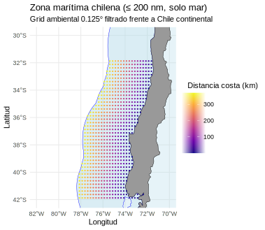
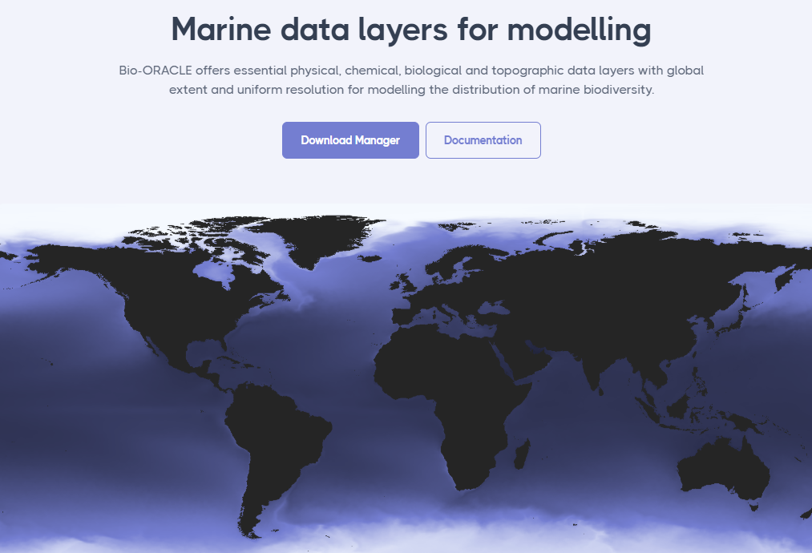
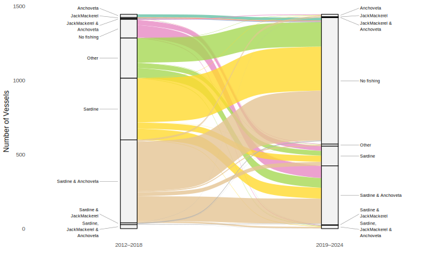
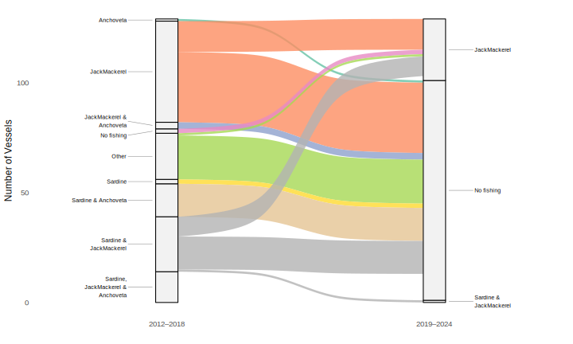

```{r setup, include=FALSE}
options(htmltools.dir.version = FALSE)
```


```{r refmanager, include=FALSE}
library(RefManageR)
source(here::here("helper.R"))
BibOptions(check.entries = FALSE, 
           bib.style = "authoryear", 
           style = "markdown",
           dashed = TRUE)
bib <- ReadBib("bibliography.bib")
citeopt <- list(max.names=3, longnamesfirst = FALSE)
```

```{r use-logo, echo=FALSE}
xaringanExtra::use_logo("https://fquezadae.github.io/Slides-Econometria/figs/depto_economia_blanco.png")
```

# Introduction

## Big picture

- Marine resource distribution and abundance is changing due to climate variability, with heterogenous spatial effects `r Citep(bib, "Poloczanska2013-qq", "sumaila2011", .opts = citeopt)`.

- Harvest levels would be affected `r Citep(bib, "Quezada2023-hc", .opts = citeopt)`, as well as price and value of catches, fishing costs, fishers’ incomes, among others `r Citep(bib, "sumaila2011", .opts = citeopt)`

???

Recordar que uno apreta C para clonar, P para Presenter View, H para tener un mapa de las teclas

---

# Introduction

## Research question

How will fishing decisions, aggregate catch levels, and the price of marine resources be affected under different climatic scenarios in the multispecies small pelagic fishery (SPF) in Chile?

  - How do fishers **substitute between species**?
  - Contribute to the limited local literature on multi-species economic modeling in Chile
    - Understand fishers’ adaptive capacity helps to inform climate-resilient fisheries policies in Chile
    - See `r Citet(bib, "Pena-Torres2017-gn", .opts = citeopt)` for ENSO effects in Jack Mackerel fishery using discrete choice models.
  - We will focus in **climate variability** to estimate short-run responses.
    - i.e., climate change effect without adaptation `r Citep(bib, "auffhammer2018", .opts = citeopt)`
    
---

# Introduction

## Why a Multi-Species Model?

- Diversification is a good strategy:
  - Improves income stability and climate resilience `r Cite(bib, "Kasperski2013-jz", "Finkbeiner2015-bs", .opts = citeopt)`
- Fishers respond to environmental variability by:
  - Maintaining the current strategy
  - **Reallocating effort to other species/areas `r Citep(bib, "Gonzalez-Mon2021-kj", .opts = citeopt)`**
  - Exiting the fishery `r Citep(bib, "Powell2022-wj", .opts = citeopt)`
  

<!-- - Under multispecies harvesting is not straighforward to study fisher harvest decisions -->
<!--   - Responses to availability vary by (i) port infrastructure, (ii) market access, and (iii) regulations `r Citep(bib, "Powell2022-wj", .opts = citeopt)` -->
<!--   - Different fishers, different choices `r Citep(bib, "Jardine2020-um", "Zhang2011-wv", .opts = citeopt)` -->
  

---

layout: false

class: inverse, center, middle


# Chile’s Small Pelagic Fishery

---

# Chile’s Small Pelagic Fishery (SPF)

## Some facts

- Mainly composed by anchoveta, Jack mackerel, Sardine
- ~94% of national catch `r Citep(bib, "SUBPESCA2020", .opts = citeopt)`
- Mostly harvested with purse-seiners
- In the Central-South (CS) region (Valparaiso-Los Lagos) all three species play a major role.
- SPF have been used primarily for fishmeal and fish oil production `r Citep(bib, "Pena-Torres2017-gn", .opts = citeopt)` (~85% of jack mackerel for reduction)
  
## Regulations
- Quota (TAC); divided between the small-scale and indutrial sector
- Industrial sector operates under ITQ
- RAE (*Regimen Artesanal de Extracción*) in some areas for small-scale fishery
  - Allocates regional quota to area or fishermen organization (i.e., catch shares)
- Anchoveta and sardine are regulated as a mixed-species fishery
  
---

# Chile’s Small Pelagic Fishery (SPF)

## Status of the stocks (CS)

- Anchoveta: 
  - Collapsed until 2018, 
  - Overexploited in 2019, 
  - Since 2020, within MSY limits. 

- Sardine:
  - Within MSY levels, except in 2021 and 2023 (overexploited)

- Jack mackerel:
  - Overexploited until 2018, then within MSY limits. 
    
---

layout: false

class: inverse, center, middle


# Methods and data

---

# Methodology Overview

Based on `r Citet(bib, "Kasperski2015-jm", .opts = citeopt)`:

1. Econometrics models
  - Estimate stock dynamics
  - Estimate trip-level costs
  - Estimate annual trips
  - Estimate inverse demand

2. Simulations 
  - Obtain optimal harvest and quota levels
  - Simulate climate change effects on profits, harvest and prices.

---

# Data Sources

## Harvest and biomass data

From IFOP:
- Trip-level data:
  - ID, departure and arrival times, vessel capacity, fleet and gear type, ports of departure and landing, haul timing and location, species, retained catch. 
- Annual stock abundance by macro region (e.g. south-central Chile)
- Monthly landings by port/species.  
- Prices paid by processing plants (IFOP surveys; month-region)

---

# Data Sources

## Environmental covariates

<style>
.pull-left { width: 45% !important; }
.pull-right { width: 53% !important; }
</style>

.pull-left[
For the period 2012-2025:

- Daily salinity, sea surface temperature, and current speed and direction `r Citep(bib, "GLORYS12V1", .opts = citeopt)`
- Hourly wind speed and direction at the surface `r Citep(bib, "WIND_GLO_PHY", .opts = citeopt)`
- Chlorophyll-a concentration `r Citep(bib, "GlobColour", .opts = citeopt)`
]

.pull-right[

]


---

# Data Sources

## To be requested

- Average wage pay to crew member per hour (available?)
- Diesel cost.
- Permits by vessels
- Quota prices (auction or secondary markets, if available)
  - Captures forward-looking behavior and information `r Citep(bib, "Birkenbach2024", .opts = citeopt)`.
  - Simplify the dynamic model to a static one `r Citep(bib, "reimer2022structural", .opts = citeopt)`.
- Quota by area/fishing organization for small-scale sector, and ITQ for industrial (by vessel?)
  - Information about Reallocations of quotas
  

---

# Data Sources

## Data for projections

.pull-left[

**Bio-ORACLE**

- Only decadal (e.g., 2040–2050) projections
- Different climate scenarios
- SST, salinity, currents and chlorophyll (4km resolution)
- No winds; CMIP6 for winds? (~100 km).
]
.pull-right[
  
]


---

layout: false

class: inverse, center, middle


# Econometrics models

---

# Model 1: Stock Dynamics 

$$x_{i,y+1} + h_{iy} = \underbrace{(1 + r_i)x_{iy} + \eta_i x_{iy}^2}_{R_i(x_{iy})} + \underbrace{\sum_{j \neq i}^{n-1} a_{ij} x_{iy} x_{jy}}_{I_i(x_y)} + \rho_i Env_{iy} + \varepsilon_{iy} \quad i=1,\ldots,n$$
where: 
- $x_{iy}$ is the fish stock by species $i=1,\ldots,n$ in year $y$, $n$ is the total number of species, 
- $h_{iy}$ is the annual harvest of species $i$ on year $y$, 
- $r_i$ is the intrinsic growth rate of the resource $i$,
- $\eta_i$ is a density-dependent factor related to the carrying capacity, 
- $\alpha_{ij}$ are the interaction parameters between species. 
- $Env_{iy}$ includes **environmental covariates** (SST and chlorophyll)

The system of $n$ growth equations can be estimated simultaneously using SUR


---

# Model 2: Trip-Level Costs

$$C_{vg} = \sum_{i=1}^{2n+M+k} \alpha_{g, \mathbf{X}_i} \mathbf{X}_{ivg} + \frac{1}{2} \sum_{i=1}^{2n+M+k} \sum_{j=1}^{2n+M+k} \alpha_{g, \mathbf{X}_i\mathbf{X}_j} \mathbf{X}_{ivg} \mathbf{X}_{jvg}$$

where $C_{vg}= w z_{vg}^*$ is the total cost incurred by vessel $v=1,\ldots,V_g$ conditional on gear used $g=1,\ldots,G$  -- Mostly purse seiners!
- $w$ is a matrix of variable input prices.
- $z_{vg}^*$ is the optimal quantity of input used
  - Crew members?
  - Time spent at sea?
  - Distance traveled?
  

---

# Model 2: Trip-Level Costs

$$C_{vg} = \sum_{i=1}^{2n+M+k} \alpha_{g, \mathbf{X}_i} \mathbf{X}_{ivg} + \frac{1}{2} \sum_{i=1}^{2n+M+k} \sum_{j=1}^{2n+M+k} \alpha_{g, \mathbf{X}_i\mathbf{X}_j} \mathbf{X}_{ivg} \mathbf{X}_{jvg}$$
where $\mathbf{X}^{'}_{vg} = [w;h_{vg};x;Z_v;Env]$ is a matrix of explanatory variables, and $\mathbf{X}_{ivg}$ represents the *i*th column of the $\mathbf{X}_{vg}$:
- $h_{vg}$ is a matrix of harvest quantities, 
- $x$ is a matrix of given stock levels of the species of interest, and 
- $Z_v$ is a matrix of given vessel characteristics. 
- $Env$ is a matrix of **environmental covariates**
  - e.g., wind intensity and wave conditions in each trip at the harvest location (or within a port radius?)

---

# Model 3: Total Annual Trips

The number of trips a vessel will take in a given year is assumed to follow a Poison distribution: 
$$Pr\left[T^{*}_{vgy} = t_v\right] = \frac{exp^{-exp(U^{'}_{vg}\beta_g)}exp(U^{'}_{vg}\beta_g)^{t_v}}{t_v !}$$
where $U_{vg}=[p,w,h_{vg},\bar{q},Z_{vg}, Env]$ is a matrix of explanatory variables,
- $p$ is a matrix of species prices, 
- $\bar{q}$ is the annual quota level.
- $Env$ include variables that reflect **annual weather conditions**
  - Accumulation of *bad weather days*? 
  - *number of storms*?
- Other variables? State dependency?

$\beta_g$ is a vector of coefficients to be estimated, and $t_v$ is the number of trips taken by vessel $v$ using gear type $g$ in year $y$.

---

# Model 4: Inverse Demand

The price of each species is modeled using an Inverse Almost Ideal Demand System (IAIDS). The log of the price $p_{iy}$ of a species $i$ in year $y$ is the following:

$$\ln p_{iy} = \sum_j^n \gamma_j \ln h_{j,y} + \gamma_{H} \ln H_y + \gamma_{FM} \ln P^\text{FishMeal}_y + \epsilon_{iy}$$
where:
- $H_y = \sum h_{j,y}$
- $P^\text{FishMeal}_y$ is the fish meal world price

Harvest may be endogenous 
  - Three Stage Least Squares (3SLS) procedure, 
  - $h_{j,y}$ instrumented by variables that affect supply function such as *SST*, *Chl*, and fuel prices.
  

---

layout: false

class: inverse, center, middle


# Numerical optimization

---

# Numerical optimization

Use models parameters to:

- Obtain the optimal **harvest** and **quota** using historical data
- Conduct numerical optimization to obtain optimal **harvest** and **quota** conditional on climate scenario.
- Evaluate **profits** and **species substitution**


---

# Numerical optimization

## Vessel maximization problem

In each year, a vessel maximizes profits by choosing their optimal number of
trips $T_g$ and harvest levels per trip $h_{g\tau}$ given a gear type:
$$\begin{align*}
\max_{h_{gt}, T_g} \quad \pi_{vgt} & = \sum_{\tau=t}^{T_g} \rho^\tau \left\{ P(h) h_{g\tau} - C_g(h_{g\tau} | w, x, Z, Env) \right\} \quad \tau = t,\ldots, T_g \nonumber \\
\textbf{s.t} \quad q_{g,t+1} & = \omega \ast \bar{q} - \sum_{t=1}^{t} h_{gt} \geq 0, \quad t = 1, \dots, T-1, \quad g = 1, \dots, G
\end{align*}$$

- where:
  - $\rho$ is the intra-annual discount factor, 
  - $\omega$ is a vector of shares of $\bar{q}$, and 
  - $h_{lt}=0$ for all $l\neq g$.

???

- The vector of shares is obtained from historical data on harvest. 
- The optimal profit from the maximization problem is $\pi_{vgy}^* (p,w,x,Z,\bar{q},\omega, Env)$, 
  - $h_{vgty}^*$ is the optimal harvest per trip.
  - $T_{vgy}^*$ optimal total number of trips.
- Optimal quota level, per year and by species, is obtained by solving the social-planner optimization problem to maximize the net value
of the fishery 


---

layout: false

class: inverse, center, middle


# Preliminary results


---

# Is there any subtitution?

## Small-scale vessels

```{r fig_strategy_transitions_ART, echo=FALSE, fig.align='center', out.width='95%'}

```

---

# Is there any subtitution?

## Industrial vessels

```{r fig_strategy_transitions_IND, echo=FALSE, fig.align='center', out.width='95%'}

```


---


# Stock dynamics

```{r sur_table, eval=FALSE, message=FALSE, warning=FALSE, include=FALSE}
library(dplyr)
library(knitr)
library(kableExtra)
library(gt)

sur_df <- readRDS("tables/table_SUR_stock.rds")

# Build a clean gt table with section dividers + smaller text
# nice em dashes for NA
sur_df <- sur_df %>% mutate(across(-term, ~ifelse(is.na(.), "-", .)))

# row indices for groups
idx_bio  <- 1:3
idx_env  <- 4:7
idx_xsp  <- 8:10
idx_fit  <- 11

tab <- sur_df |>
  gt(rowname_col = "term") |>
  # Header + spanner
  tab_header(
    title = md("**Seemingly Unrelated Regression (SUR) estimates of biomass dynamics for small pelagic species in Central–Southern Chile.**")
  ) |>
  tab_spanner(label = "Species", columns = c(Sardine, Anchoveta, `JackMackerel`)) |>
  cols_label(
    Sardine = md("*Sardine*"),
    Anchoveta = md("*Anchoveta*"),
    `JackMackerel` = md("*Jack mackerel*")
  ) |>
  # Group rows (top → bottom order)
  tab_row_group(label = "Biomass dynamics",        rows = idx_bio) |>
  tab_row_group(label = "Environmental effects",   rows = idx_env) |>
  tab_row_group(label = "Cross-species interactions", rows = idx_xsp) |>
  tab_row_group(label = "Model fit",               rows = idx_fit) |>
  row_group_order(c("Biomass dynamics","Environmental effects","Cross-species interactions","Model fit")) |>
  # Compact, clean theme
  opt_table_font(font = list(google_font("Source Serif 4"), default_fonts())) |>
  tab_options(
    table.width = px(820),
    table.font.size = px(15),         # adjust if you need smaller/bigger
    data_row.padding = px(3),
    row_group.padding = px(6),
    heading.title.font.size = px(18),
    column_labels.background.color = "white",
    table.border.top.color = "black",
    table.border.top.width = px(2),
    table.border.bottom.color = "black",
    table.border.bottom.width = px(2),
    row_group.background.color = "#f7f7f7",
    row_group.border.top.color = "#bdbdbd",
    row_group.border.top.width = px(1),
    row_group.border.bottom.color = "#bdbdbd",
    row_group.border.bottom.width = px(1)
  ) |>
  # crisp inner gridlines
  tab_style(
    style = cell_borders(sides = "top", color = "#d0d0d0", weight = px(1)),
    locations = cells_body(rows = everything())
  ) |>
  # note
  tab_source_note(md("Entries are coefficients; significance: * p<0.10, ** p<0.05, *** p<0.01. Quadratic terms shown with “sq”; interactions use ×."))

# Save as a crisp PNG (works 100% in xaringan)
gtsave(tab, "tables/table_SUR_stock.png", vwidth = 4000, vheight = 3600, zoom = 10)
```

```{r include_sur_table, echo=FALSE, fig.align='center', out.width='80%'}
knitr::include_graphics("tables/table_SUR_stock.png")
```

- SST and CHL improves model performance (F = 1.908; $p$-value = 0.07).

???

- Herrick, et al. (2009): "Sardine is known to be more productive during warm-water regimes in the California Current ecosystem."

---

# What’s Next?

- Finish biomass estimations
- Start soon with total annual trips
  - Hopefully, a short paper can come out of that work
- Two undergraduate students are working on the inverse demand (i.e., price) module for their theses
  - Results expected by July 2026
  - If time allows, they will also analyze long-run and short-run dynamics using a VEC model
  - Plan to write a paper based on their dissertations

---

layout: false

class: inverse, center, middle


# ¡Muchas gracias!

<span style="color:#f59f18; font-size:1.3em; font-weight:bold;">¿Preguntas?</span>

<div style="margin-top: 50px;"></div>


**Felipe J. Quezada-Escalona**  


<a href="https://felipequezada.com" target="_blank" style="
  font-size:1em;
  background:linear-gradient(#f59f18);
  -webkit-background-clip:text;
  -webkit-text-fill-color:transparent;
  text-decoration:none;
">
🌐 felipequezada.com
</a>

<br>

<br>

<span style="font-size:0.8em; color:lightgray;">
I gratefully acknowledge financial support for this research from ANID-Chile, under project Fondecyt Iniciación No. 11250223.
</span>


```{r message=FALSE, warning=FALSE, include=FALSE}
pagedown::chrome_print("slides.html", output = "slides.pdf")

```

<!-- --- -->

<!-- # Temas de investigación en curso -->


<!-- - Modelos de elección discreta para el estudio del efecto de cambios en la distribución de especies pelágicas en las decisiones de pesca en la costa oeste de EEUU (localización, especie y participación)  -- Enviado a *Ecological Economics* -->
<!--   - ¿Hacer lo mismo para Chile? Idea: basados en `r Citet(bib, "Birkenbach2024", .opts = citeopt)`, crear contrafactuales para fraccionamiento, o cambios en variables climáticas. Validar con periodos observados. -->
<!--   - ¿Como endogeneizar los precios en modelos de eleccion discreta, los cuales dependen de la frecuencia en que pescadores participan? (ojo: no es lo mismo que instrumentar) -->

<!-- - Colaborando con NOAA Fisheries en: -->
<!--   - El desarrollo de proyecciones de desembarque futuro bajo distintos modelos climáticos que afectan la distribución de especies. -->
<!--   - La incorporación de un modelo de teoría de juegos a modelos de evaluación de stock que consideran especies transfronterizas. -->

<!-- --- -->

<!-- # Areas de posible colaboración con INCAR2/SE -->

<!-- - Impacto de la variación climática (u otro shock exógeno?) en las decisiones de cosecha de centros de cultivos (o productores de pequeña escala)?  -->
<!--   - Algo similar a lo hecho con SPF para USA -->
<!--   - Es como lo que hace Adams con HAB pero tal vez con modelo de elección discreta en vez de modelo de causalidad -- Crear contrafactuales como en `r Citet(bib, "Birkenbach2024", .opts = citeopt)`. -->

<!-- - Relación entre las etapas de producción en áreas estuarinas y marinas (ejemplo: ¿La eficiencia técnica en agua dulce predice eficiencia técnica en etapa de agua salada?). -->

<!-- - Estimar patrones de sustitución de demanda de salmón en *XX* país usando modelo BLP, y como estos patrones se pudieron ver afectados por algún evento (e.g., marea roja) -- Idea de Manuel -->

<!-- --- -->

<!-- # Areas de posible colaboración con INCAR2/SE -->

<!-- - ¿Conectar el modelo para SPF ha elaborar en el proyecto FONDECYT a los costos de alimentación de la acuicultura en Chile? (Comentario de Jorge cuando me adjudique el FONDECYT)​ -->

<!-- - Early Warning System usando indicadores económicos (Estoy inscrito en ese tema en la línea de Renato -- Adams Ceballos le interesa participar) -->

<!-- --- -->

---


# References

```{r, results='asis', echo=FALSE, warning=FALSE}
print_bib_rmd(bib, start = 1, stop = 5)
```

---


# References

```{r, results='asis', echo=FALSE, warning=FALSE}
print_bib_rmd(bib, start = 6, stop = 10)
```

---


# References

```{r, results='asis', echo=FALSE, warning=FALSE}
print_bib_rmd(bib, start = 11, stop = 15)
```

---


# References

```{r, results='asis', echo=FALSE, warning=FALSE}
print_bib_rmd(bib, start = 16, stop = 20)
```


