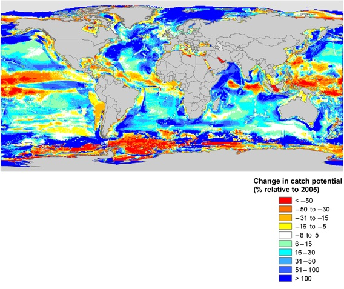
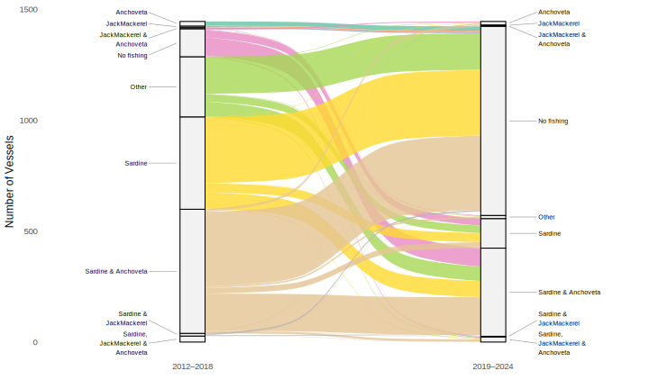
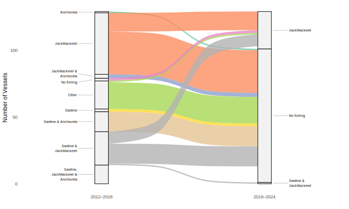
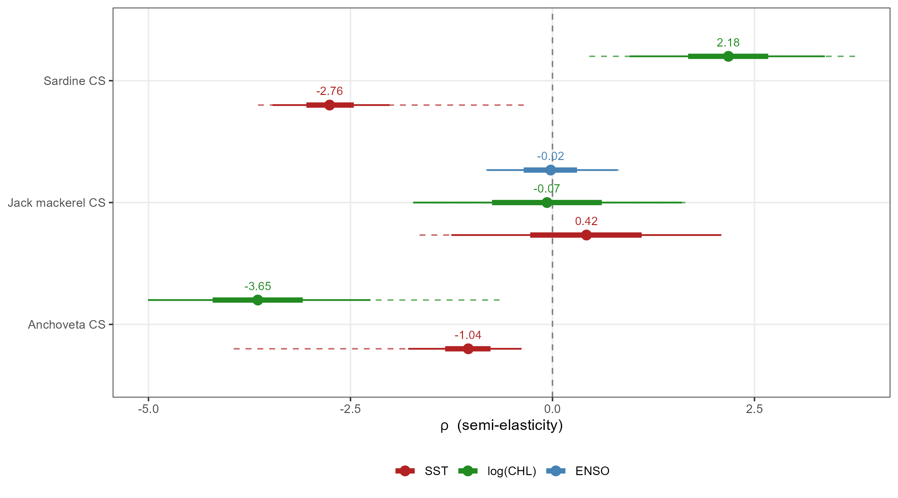
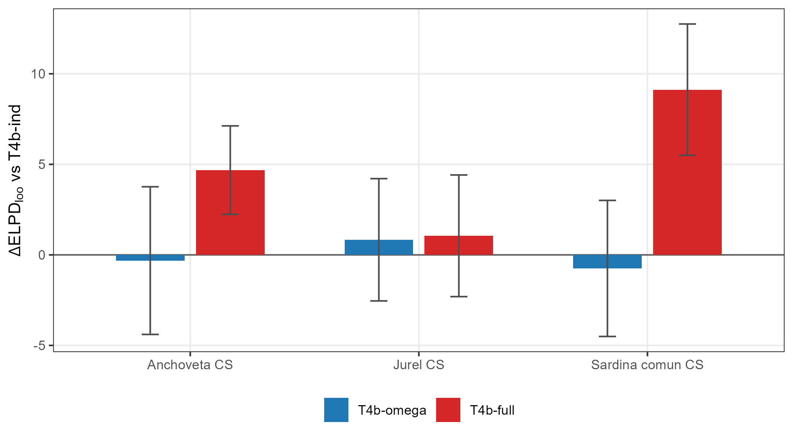
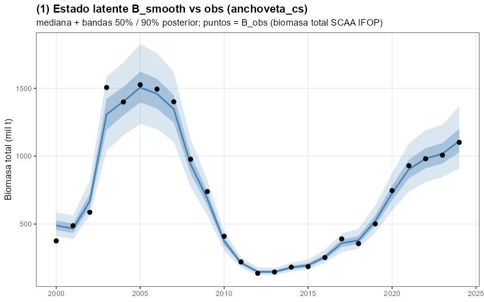
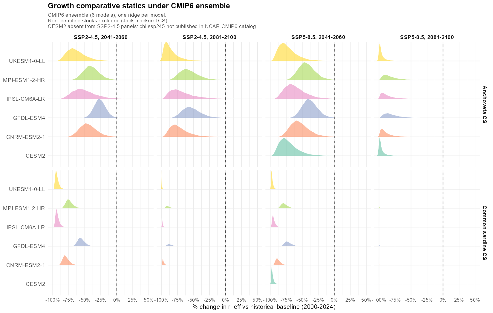

class: title-slide, center, middle, inverse

# The Impact of Environmental Variability on Fishers' Harvest Decisions in Chile
## A multi-species structural approach &mdash; FONDECYT project, 2025&ndash;2028


**Felipe J. Quezada-Escalona**

Departamento de Econom&iacute;a &mdash; Universidad de Concepci&oacute;n

ICES/PICES Small Pelagic Symposium &mdash; La Paz, M&eacute;xico
May 8, 2026

```{r setup, include=FALSE}
options(htmltools.dir.version = FALSE)
knitr::opts_chunk$set(echo = FALSE, message = FALSE, warning = FALSE)
```

```{r use-logo, echo=FALSE}
xaringanExtra::use_logo(
  image_url = "https://fquezadae.github.io/Slides-Econometria/figs/depto_economia_blanco.png",
  exclude_class = c("inverse", "hide_logo", "title-slide")
)
```

---

# Motivation

<style>
.pull-left { width: 47% !important; }
.pull-right { width: 51% !important; }
.small-note { font-size: 0.75em; color: #555; }
.tight ul { margin-top: 0; margin-bottom: 0; }
.tight li { margin-bottom: 2px; }
.framebox { border: 1.5px solid #113b63; border-radius: 6px; padding: 8px 12px; margin: 6px 0; }
.framebox-gold { border: 1.5px solid #f59f18; border-radius: 6px; padding: 8px 12px; margin: 6px 0; background: #fffaf0; }
</style>


.pull-left[
- Small pelagic stocks fluctuate sharply &mdash; biology, prices, regulation, weather all move year-to-year.

- Standard projection tools assume **constant fishing rates or full quota uptake** &mdash; the choice is assumed away.

- But fishers **choose**: whether to participate, which species to target, how many trips to take.

- These choices are **mediated** by quotas (LMCA), portfolio composition, and operating constraints.

- **My approach:** treat fisher participation as a *count process* &mdash; estimate it separately by fleet, then propagate to comparative statics.
]

.pull-right[


<span style="font-size:0.55em; display:block; text-align:right; margin-top:4px;">
**Source:** Cheung et al. (2010)
</span>

]

> Today: identification strategy + heterogeneity in revealed responses + roadmap to welfare counterfactuals.


???

Recordar que uno apreta C para clonar, P para Presenter View, H para tener un mapa de las teclas
1 min. Setup r&aacute;pido. No clima como protagonista; clima como *un* shifter del entorno.


---

# The project &mdash; two papers, one structural pipeline

.pull-left[
.framebox-gold[
**Paper 1** (today's results)
*Reduced-form effort + identified stock dynamics*

- **Negative binomial** trip equation, estimated separately by fleet (LMCA-induced cross-sectional variation in $H^{alloc}$).
- Bayesian state-space stock dynamics with structural climate shifters (in appendix).
- Comparative statics under counterfactual scenarios.

Target submission 2026.
]
]

.pull-right[
.framebox[
**Paper 2** (today's roadmap)
*Welfare counterfactuals*

- Translog **cost** function (intra-annual, by gear).
- **Inverse demand** (IAIDS, 3SLS).
- **Dynamic vessel optimization** $\Rightarrow$ optimal $T_g, h_{g\tau}$ under counterfactual shocks.
- Welfare, prices, **species substitution**.

Estimation 2026&ndash;2027.
]
]

> The two papers share the **same identified stock dynamics**. Paper 1 stops at participation; Paper 2 closes the loop through prices and profits.

???

- Slide de framing &mdash; expone proyecto, no paper aislado.
- Liga directo a S9 bullet 1 (participation) y bullet 3 (markets/prices).

---

layout: false

class: inverse, center, middle

# Setting and observed heterogeneity

---

# Chile's Small Pelagic Fishery (Centro-Sur)

.pull-left[
## Stocks & sectors
- **Anchoveta**, **common sardine**, **jack mackerel**.
- ~94% of national landings; mostly purse seiners.
- Two sectors: **artisanal** (ART), **industrial** (IND).

## The LMCA quota regime
- *L&iacute;mite M&aacute;ximo de Captura por Armador*: TAC split between sectors with **limited cross-sector transferability**.
- IND quotas partially tradable within sector; ART partly under **RAE**.
]

.pull-right[
## Fleet portfolios are very different

- **ART**: ~ {anchoveta, sardine}. Concentrated.
- **IND**: ~ 95% jack mackerel + 5% sardine. Diversified into the *transboundary* stock.

## Mobility

- IND: offshore purse-seiners.
- ART: port-anchored, RAE binds spatially.

$\Rightarrow$ Same shock, **different choice sets**.
]

???

- LMCA es la pieza institucional clave; H_alloc es la variable que acopla TAC a comportamiento.

---

# Observed strategy switching &mdash; ART vs IND

.pull-left[
**Artisanal**

```{r fig_strategy_transitions_ART, out.width='95%', fig.align='center'}

```
]

.pull-right[
**Industrial**

```{r fig_strategy_transitions_IND, out.width='95%', fig.align='center'}

```
]

<span class="small-note">Trip-level target-species transitions, IFOP logbooks 2013&ndash;2024.</span>

> ART: anchoveta&harr;sardine dominates; jurel essentially absent. IND: rotation across all three. Same fishery, very different revealed choice sets.

???

- 30s. Visual setup para por qu&eacute; se estima por flota.

---

layout: false

class: inverse, center, middle

# Paper 1 &mdash; The NB trip equation

---

# A negative binomial model of annual trips

.pull-left[
## Specification, by fleet $g$ (ART, IND)

$$T_{vy}^g \sim \text{NB}\!\left(\exp(U_{vy}'\beta_g),\,\theta_g\right)$$

with $U_{vy} = \big[\,p_{sy},\; H^{alloc}_{vy},\; Z_v,\; O_{vy}\,\big]$:

- $p_{sy}$: ex-vessel prices, by species.
- $H^{alloc}_{vy}$: vessel-level quota allocation (LMCA $\times$ RAE).
- $Z_v$: hold capacity, vessel type.
- $O_{vy}$: bad-weather days, *vedas*.
]

.pull-right[
## Why NB, why by fleet?

- Overdispersion $\sigma^2/\mu$: **22.4** (ART), **4.9** (IND). Poisson rejected at $p < 0.001$.
- Two fleets, two technologies, two choice sets &mdash; no pooling.
- Vessel-clustered robust SEs.

## Identification of $\beta_g$

LMCA shares vary across **vessels** $\times$ **years** (regional TAC moves; vessel share fixed). Reduced-form mapping; full structural identification deferred to Paper 2.
]

???

- Audience S9: enfatizar que la NB es un *modelo de elecci&oacute;n* (count process) &mdash; no es solo descriptivo.
- Identification claim honesta: reduced form, suficiente para mapear cambios en environment a effort.

---

# What drives fisher participation? &mdash; Estimates by fleet

<table style="width:100%; font-size:0.78em; border-collapse:collapse;">
<thead>
<tr style="border-bottom:2px solid #113b63;">
<th style="text-align:left; padding:5px 8px; width:28%;">Variable</th>
<th style="text-align:center; padding:5px 8px; width:14%;">Industrial</th>
<th style="text-align:center; padding:5px 8px; width:14%;">Artisanal</th>
<th style="text-align:left; padding:5px 8px; width:44%;">Reads as</th>
</tr>
</thead>
<tbody>
<tr style="border-bottom:1px solid #ddd;">
<td style="padding:4px 8px;">$H^{alloc}_{vy}$ (allocated quota)</td>
<td style="text-align:center;"><b>(+)&#8201;<sup>***</sup></b></td>
<td style="text-align:center;"><b>(+)&#8201;<sup>***</sup></b></td>
<td style="padding:4px 8px;">Quota = binding budget constraint, both fleets.</td>
</tr>
<tr style="border-bottom:1px solid #ddd;">
<td style="padding:4px 8px;">Price &mdash; jack mackerel</td>
<td style="text-align:center;"><b>(+)&#8201;<sup>***</sup></b></td>
<td style="text-align:center;">0</td>
<td style="padding:4px 8px;">IND oriented to jurel; ART has no exposure.</td>
</tr>
<tr style="border-bottom:1px solid #ddd;">
<td style="padding:4px 8px;">Price &mdash; sardine</td>
<td style="text-align:center;">0</td>
<td style="text-align:center;"><b>(+)&#8201;<sup>***</sup></b></td>
<td style="padding:4px 8px;">Sardine is ART's primary target.</td>
</tr>
<tr style="border-bottom:1px solid #ddd;">
<td style="padding:4px 8px;">Price &mdash; anchoveta</td>
<td style="text-align:center;">0</td>
<td style="text-align:center;"><b>(&minus;)&#8201;<sup>***</sup></b></td>
<td style="padding:4px 8px;">Simultaneity sign &mdash; addressed in Paper 2.</td>
</tr>
<tr style="border-bottom:1px solid #ddd;">
<td style="padding:4px 8px;">Hold capacity (log)</td>
<td style="text-align:center;">0</td>
<td style="text-align:center;"><b>(+)&#8201;<sup>***</sup></b></td>
<td style="padding:4px 8px;">Heterogeneity is <i>within</i> the artisanal fleet.</td>
</tr>
<tr style="border-bottom:1px solid #ddd;">
<td style="padding:4px 8px;">Bad-weather days</td>
<td style="text-align:center;">0</td>
<td style="text-align:center;"><b>(&minus;)&#8201;<sup>***</sup></b></td>
<td style="padding:4px 8px;">ART vulnerable; IND insulated by vessel size.</td>
</tr>
<tr style="border-bottom:2px solid #113b63;">
<td style="padding:4px 8px;"><i>Veda</i> days</td>
<td style="text-align:center;"><b>(&minus;)&#8201;<sup>***</sup></b></td>
<td style="text-align:center;">n/a</td>
<td style="padding:4px 8px;">Largest single coefficient for IND.</td>
</tr>
</tbody>
</table>

<span class="small-note">Negative binomial, vessel-clustered robust SEs. Sign and significance shown; full table in appendix. <sup>***</sup> $p < 0.01$.</span>

> Two fleets, **completely different participation models**. Same regulatory variables, opposite signs.

???

- Slide central de "human choices". Cada coeficiente cuenta una historia distinta por flota.
- Anchoveta-precio negativo en ART: simultaneidad (low avail. = high price + low effort). Motivaci&oacute;n directa para Paper 2 (IAIDS).

---

# Comparative statics &mdash; the fleet asymmetry

| Fleet | Counterfactual | $\%\Delta T$ (marginal) | $\Pr(\text{portfolio loss} > 50\%)$ |
|---|---|---:|---:|
| **Artisanal** | mid-century, moderate scenario | **&minus;8.7%** | **0.95** |
| | end-century, severe scenario | **&minus;9.4%** | **0.99** |
| **Industrial** | mid-century, moderate | &minus;0.9% | 0.12 |
| | end-century, severe | &minus;0.9% | 0.12 |

.pull-left[
- ART: ~9&times; larger contraction than IND.
- ART: near-certain portfolio loss.
- *Conditional* on no portfolio loss: &minus;2% ART vs &minus;1% IND.
]

.pull-right[
- $\Rightarrow$ Asymmetry runs through **portfolio composition + LMCA cross-sector limits**.
- *Not* through trip-level price elasticities.
- IND's protection partly rests on jurel &mdash; whose long-run shifter is **n.i.** (deferred).
]

???

- Si recuerdan una sola tabla: esta. Asimetr&iacute;a 9:1 ART:IND no es preferencias &mdash; es estructura institucional.

---

layout: false

class: inverse, center, middle

# Paper 2 &mdash; closing the loop

---

# Three structural extensions &Rightarrow; welfare counterfactuals

.pull-left[
## (i) Trip-level cost (translog)
$$C_{vg} = \sum_i \alpha_{g,X_i} X_{ivg} + \tfrac{1}{2}\sum_{i,j}\alpha_{g,X_i X_j} X_{ivg}X_{jvg}$$

with $X_{vg}=[w; h_{vg}; x; Z_v; Env]$. SUR per gear.

## (ii) Inverse demand (IAIDS)
$$\ln p_{iy} = \sum_j \gamma_j \ln h_{j,y} + \gamma_H \ln H_y + \gamma_{FM} \ln P^{FM}_y + \epsilon_{iy}$$

3SLS; $h_{j,y}$ instrumented by SST, CHL, fuel prices.

$\Rightarrow$ resolves the anchoveta-price puzzle from Paper 1.
]

.pull-right[
## (iii) Vessel dynamic optimization
$$\max_{\,h_{g\tau},\,T_g\,} \sum_{\tau=1}^{T_g}\delta^\tau\!\left\{P(h)\,h_{g\tau} - C_g(h_{g\tau}\!\mid\!w,x,Z,Env)\right\}$$
$$\text{s.t.}\;\; q_{t+1}=\omega\,\bar q - {\textstyle\sum} h_{g\tau}\geq 0$$

## Counterfactuals it enables
- **Equilibrium price adjustment** under reduced supply.
- **Species substitution** within the harvest decision.
- **Policy levers**: LMCA cross-sector reform, RAE redesign, state-contingent TACs &mdash; each evaluated as an *adaptation instrument*, not just allocation.
]

???

- Spec base de Kasperski (2015) + Birkenbach et al. (2024).
- Tie-back a S9: bullet 3 (markets/prices), bullet 4 (cooperation/conflict for transboundary jurel).

---

# Takeaways

.tight[
1. **Paper 1**: a fleet-specific NB model of annual trips reveals **two completely different participation technologies** in the same fishery &mdash; ART and IND respond to different prices, different operating constraints, different scales.

2. **Paper 1**: under counterfactual shocks, the ART:IND participation asymmetry is **~9:1**. The mechanism is **portfolio composition $\times$ LMCA cross-sector limits**, not differential elasticities.

3. **Paper 2**: closes the loop &mdash; cost, demand, dynamic optimization &mdash; to deliver welfare counterfactuals and evaluate policy reforms (LMCA transferability, RAE redesign).

4. **Joint message for S9**: adaptive capacity is not a property of fishers; it is a property of the **bundle (portfolio &times; permit &times; institution &times; market)** they sit in. The empirical model has to respect that structure.
]

???

- 1 min. Cierra el loop con bullet 1 de S9.

---

layout: false

class: inverse, center, middle

# &iexcl;Gracias! / Thank you

<span style="color:#f59f18; font-size:1.3em; font-weight:bold;">Questions?</span>

<br>

**Felipe J. Quezada-Escalona**
[felipequezada@udec.cl](mailto:felipequezada@udec.cl) &middot; [felipequezada.com](https://felipequezada.com)

<br>


<span style="font-size:0.75em; color:lightgray;">
Funded by ANID-Chile, FONDECYT Iniciaci&oacute;n N&deg; 11250223.
</span>

---

# Selected references

.tight[
- Birkenbach, A.M. et al. (2024). Catch shares and the management of multispecies fisheries. *MRE*.
- Cheung, W.W.L. et al. (2010). Large-scale redistribution of maximum fisheries catch potential. *GCB*.
- Free, C.M. et al. (2019). Impacts of historical warming on marine fisheries production. *Science*.
- Kasperski, S. (2015). Optimal multispecies harvesting in ecologically and economically interdependent fisheries. *ERE*.
- Kasperski, S. & Holland, D.S. (2013). Income diversification and risk for fishermen. *PNAS*.
- Lam, V.W.Y. et al. (2016). Projected change in global fisheries revenues. *Sci Rep*.
- Pe&ntilde;a-Torres, J. et al. (2017). Multi-species mixed fisheries in Chile. *Marine Policy*.
- Reimer, M.N. & Haynie, A.C. (2022). Structural models in fisheries economics. *ARRE*.
- Sumaila, U.R. et al. (2011). Climate change impacts on world fisheries. *Nature CC*.
- Quezada, F.J. (2026). Climate variability and fishers' decisions on the U.S. West Coast.
]

---

layout: false

class: inverse, center, middle

# Appendix

---

# Appendix A &middot; Stock dynamics &mdash; spec & priors

.pull-left[
**Process** (Schaefer with shifter on $r$):
$$B_{i,t+1} = B_{i,t} + r_{i,t}B_{i,t}\!\left(1 - \tfrac{B_{i,t}}{K_i}\right) - C_{i,t} + \varepsilon_{i,t}$$

with structural climate shifter
$$r_{i,t} = r_i^{0}\exp\!\big(\rho_i^{SST}\Delta SST_{t-1} + \rho_i^{CHL}\Delta\log CHL_{t-1}\big)$$

**Observation** (log-normal):
$\log B_{i,t}^{obs} = \log B_{i,t} + u_{i,t}$.

Three nested specs: **ind**, **omega**, **full**.
]

.pull-right[
**Priors:**
- $r_i^0, K_i, \sigma_{proc}, \sigma_{obs}$: from IFOP / SPRFMO single-species assessments.
- $\rho_i^{SST}, \rho_i^{CHL} \sim \mathcal{N}(\hat\rho_i^{stress},\,1)$.
- $\Omega$: LKJ.

**Estimation:** Stan / HMC, 4 chains $\times$ 2000 post-warmup; $\hat R < 1.01$, $ESS > 400$.
]

---

# Appendix B &middot; Climate shifters &mdash; posterior identification

```{r fig_rho_shifters, out.width='62%', fig.align='center'}

```

<span class="small-note">Posterior densities of $\rho^{SST}$ and $\rho^{CHL}$, full multi-species specification. Anchoveta and common sardine: priors dominated by data. Jack mackerel: posteriors track priors $\to$ **n.i.** and reported as such throughout.</span>

---

# Appendix C &middot; Stock productivity comparative statics

| Stock | Scenario | $\Delta r/r_0$ (median) | 90% CI | $\Pr(\Delta < 0)$ |
|---|---|---:|---:|---:|
| **Anchoveta** | SSP2-4.5, mid-century | **&minus;51%** | [&minus;74%, &minus;17%] | 0.99 |
| | SSP5-8.5, end-century | **&minus;89%** | [&minus;98%, &minus;50%] | 0.99 |
| **Sardine** | SSP2-4.5, mid-century | **&minus;90%** | [&minus;95%, &minus;82%] | 1.00 |
| | SSP5-8.5, end-century | **&minus;100%** | [&minus;100%, &minus;99%] | 1.00 |
| Jack mackerel | all scenarios | n.i. | n.i. | n.i. |

---

# Appendix D &middot; Why is jack mackerel n.i.?

.tight[
- Posteriors track priors across alternative spatial windows and biomass series.

- The CS biomass signal carries little information about climate shifters &mdash; pre-2002 acoustic gap, censored 2012/2015 observations, transboundary SPRFMO-scale dynamics.

- Reduced-form linear stress tests on growth increments do **not** close the hindcast under SST/CHL forcing alone, consistent with structural non-identification.

- **Implication:** climate-driven projection for jurel CS must come from a **transboundary, game-theoretic** model (cf. Session S9, bullet 2), not a CS-only structural fit.
]

---

# Appendix E &middot; Model comparison (LOO)

```{r loo_compare, out.width='65%', fig.align='center'}

```

<span class="small-note">LOO ELPD across specs: **ind** ($\Omega$ diagonal, $\rho=0$), **omega** ($\Omega$ full, $\rho=0$), **full** ($\Omega$ full, $\rho \neq 0$). Full wins at $\Delta\text{ELPD} \approx 14$&ndash;$18$; LFO one-step-ahead essentially tied.</span>

---

# Appendix F &middot; Posterior predictive check

```{r ppc, out.width='75%', fig.align='center'}

```

<span class="small-note">Smoothed posterior of biomass vs observed acoustic estimates, full model.</span>

---

# Appendix G &middot; CMIP6 ensemble &mdash; ridgeline

```{r ridgeline, out.width='80%', fig.align='center'}

```

<span class="small-note">Posterior $\Delta r / r_0$ across SSP $\times$ period combinations.</span>

---

# Appendix H &middot; Paper 2 &mdash; data inputs

.tight[
**Already in hand (Paper 1):**
- Trip-level catch and price data (IFOP, 2013&ndash;2024).
- Vessel characteristics & ports of operation.
- Environmental covariates (Copernicus, GlobColour).

**To request / acquire for Paper 2:**
- Variable-input prices: crew wage, diesel cost, ice & supplies.
- Quota prices (auction or secondary markets, if available; informs forward-looking behavior cf. Birkenbach et al. 2024).
- Permits by vessel; ITQ holdings by sector.
- LMCA quota allocations and inter-fleet transfers (SERNAPESCA).
- Fish-meal world price &mdash; demand instrument.
]
