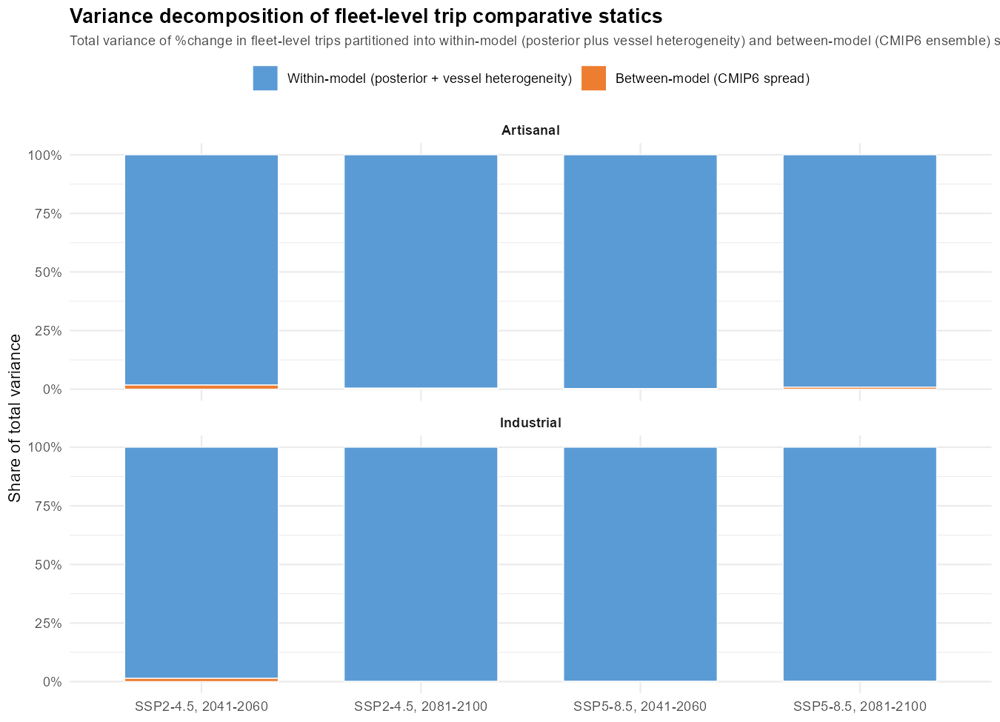

```{r setup, include=FALSE}
options(htmltools.dir.version = FALSE)
knitr::opts_chunk$set(echo = FALSE, message = FALSE, warning = FALSE)
```

```{r use-logo, echo=FALSE}
xaringanExtra::use_logo("https://fquezadae.github.io/Slides-Econometria/figs/depto_economia_blanco.png")
```

# Motivation

<style>
.pull-left { width: 55% !important; }
.pull-right { width: 45% !important; }
.small-note { font-size: 0.75em; color: #555; }
.tight ul { margin-top: 0; margin-bottom: 0; }
.tight li { margin-bottom: 2px; }
</style>


.pull-left[
- Small pelagic stocks fluctuate sharply with climate variability.

- **Standard projection tools assume constant fishing rates or full quota uptake** &mdash; the human decision is assumed away.

- But fishers **choose**: which species to target, how many trips, how much to land.
]

.pull-right[


<span style="font-size:0.55em; display:block; text-align:right; margin-top:4px;">
**Source:** Cheung et al. (2010)
</span>
]

.tldr[**Project goal:** propagate climate-driven biomass shifts into *fisher-side* responses &mdash; participation today (Paper 1), **optimal harvest decisions** in the full structural model (Paper 2).]


???

Recordar que uno apreta C para clonar, P para Presenter View, H para tener un mapa de las teclas
1 min. Setup r&aacute;pido. No clima como protagonista; clima como *un* shifter del entorno.


---

# The project &mdash; two papers, one structural pipeline

.pull-left[
.card[
**Paper 1** (today's results)
*Reduced-form effort + identified stock dynamics*

- **Negative binomial** trip equation, estimated separately by fleet.
- Bayesian state-space stock dynamics with structural climate shifters (in appendix).
- Comparative statics under future climate scenarios.
]
]

.pull-right[
.card[
**Paper 2** (today's roadmap)
*Welfare counterfactuals*

- Translog **cost** function (trip-level, by fleet).
- **Inverse demand** (IAIDS, 3SLS).
- **Dynamic vessel optimization** $\Rightarrow$ optimal $T_g, h_{g\tau}$ under different climate scenarios.
- Welfare, prices, **species substitution**.

]
]

<div style="height: 100px;"></div>

.tldr[The two papers share the **same identified stock dynamics**. Paper 1 stops at participation; Paper 2 closes the loop through prices, cost and profits to estimate optimal harvest and quota allocation.]

???

- Slide de framing &mdash; expone proyecto, no paper aislado.
- Liga directo a S9 bullet 1 (participation) y bullet 3 (markets/prices).

---

layout: false

class: inverse, center, middle

# Setting and observed heterogeneity

---

# Chile's Small Pelagic Fishery (Centro-Sur)

.pull-left[
## Stocks & sectors
- **Anchoveta** (*Engraulis ringens*), **sardine** (*Strangomera bentincki*), **jack mackerel** (*Trachurus murphyi*).
- ~94% of national landings; mostly purse seiners.
- Two sectors: **artisanal** (ART), **industrial** (IND).

## Quota regime
- TAC split between sectors with **limited cross-sector transferability**.
- IND quotas partially tradable within sector; ART under spatial collective-property rights (i.e. **RAE**).
]

.pull-right[
## Fleet portfolios are very different

- **ART**: ~ {anchoveta, sardine}. Concentrated.
- **IND**: ~ 95% jack mackerel + 5% sardine.

## Mobility

- IND: offshore purse-seiners.
- ART: port-anchored, RAE binds spatially.

$\Rightarrow$ Same shock, **different choices**.
]

???

- LMCA es la pieza institucional clave; H_alloc es la variable que acopla biomasa a comportamiento.

---

# Observed strategy switching &mdash; ART vs IND

.pull-left[
**Artisanal**

```{r fig_strategy_transitions_ART, out.height='260px', fig.align='center'}
knitr::include_graphics("../figs/strategy_transitions_ART.svg")
```
]

.pull-right[
**Industrial**

```{r fig_strategy_transitions_IND, out.height='260px', fig.align='center'}
knitr::include_graphics("../figs/strategy_transitions_IND.svg")
```
]

<div style="clear: both; text-align: center; margin-top: 8px;">
<span class="small-note">Trip-level target-species transitions, IFOP logbooks 2013&ndash;2024.</span>
</div>

.tldr[ART: anchoveta&harr;sardine dominates; jack mackerel essentially absent. IND: rotation across all three. Same fishery, very different revealed choice sets.]

???

- 30s. Visual setup para por qu&eacute; se estima por flota.

---

layout: false

class: inverse, center, middle

# Paper 1 &mdash; The NB trip equation

---

# A negative binomial model of annual trips

.pull-left[
## Specification, by fleet $g$ (ART, IND)

$$T_{vy}^g \sim \text{NB}\!\left(\exp(U_{vy}'\beta_g + \alpha_y^g),\,\theta_g\right)$$

with $U_{vy} = \big[\,p_{sy},\; H^{alloc}_{vy},\; Z_v,\; O_{vy}\,\big]$:

- $p_{sy}$: ex-vessel prices, by species.
- $H^{alloc}_{vy}$: vessel-level quota allocation.
- $Z_v$: hold capacity, vessel type.
- $O_{vy}$: bad-weather days, closures.
- $\alpha_y^g$: **year FE** (absorbs 2019&ndash;22 shocks).
- Vessel-clustered robust SEs.
]

.pull-right[
## Why NB by fleet?

- Overdispersion $\sigma^2/\mu$: **22.4** (ART), **4.9** (IND). Poisson rejected at $p < 0.001$.
- Two fleets, two technologies, two choice sets &mdash; no pooling.

## Two channels to projections

- **Indirect**: structural shifters $\rho^{SST}_i, \rho^{CHL}_i \to B_{i,t} \to H^{alloc}_{vy}$. *Jurel: $\rho_{ENSO}$ over Ni&ntilde;o 3.4 **also not identified** (App. D-ter).*
- **Direct**: vessel-specific $\Delta$bad-weather days from CMIP6 winds.
]

???

- Audience S9: enfatizar que la NB es un *modelo de elecci&oacute;n* (count process) &mdash; no es solo descriptivo.
- Identification claim honesta: reduced form, suficiente para mapear cambios en environment a effort.
- H_alloc es la variable que acopla biomasa a comportamiento.

---

# What drives fisher participation?

<table style="width:100%; font-size:0.78em; border-collapse:collapse;">
<thead>
<tr style="border-bottom:2px solid #113b63;">
<th style="text-align:left; padding:5px 8px; width:28%;">Variable</th>
<th style="text-align:center; padding:5px 8px; width:14%;">Industrial</th>
<th style="text-align:center; padding:5px 8px; width:14%;">Artisanal</th>
<th style="text-align:left; padding:5px 8px; width:44%;">Reads as</th>
</tr>
</thead>
<tbody>
<tr style="border-bottom:1px solid #ddd;">
<td style="padding:4px 8px;">$H^{alloc}_{vy}$</td>
<td style="text-align:center;"><b>(+)&#8201;<sup>***</sup></b></td>
<td style="text-align:center;"><b>(+)&#8201;<sup>***</sup></b></td>
<td style="padding:4px 8px;">Quota = binding budget constraint, both fleets.</td>
</tr>
<tr style="border-bottom:1px solid #ddd;">
<td style="padding:4px 8px;">Price &mdash; jack mackerel</td>
<td style="text-align:center;"><b>(+)&#8201;<sup>***</sup></b></td>
<td style="text-align:center;">0</td>
<td style="padding:4px 8px;">IND oriented to jack mackerel; ART has no exposure.</td>
</tr>
<tr style="border-bottom:1px solid #ddd;">
<td style="padding:4px 8px;">Price &mdash; sardine</td>
<td style="text-align:center;">0</td>
<td style="text-align:center;"><b>(+)&#8201;<sup>***</sup></b></td>
<td style="padding:4px 8px;">Sardine is ART's primary target.</td>
</tr>
<tr style="border-bottom:1px solid #ddd;">
<td style="padding:4px 8px;">Price &mdash; anchoveta</td>
<td style="text-align:center;">0</td>
<td style="text-align:center;"><b>(&minus;)&#8201;<sup>***</sup></b></td>
<td style="padding:4px 8px;">Simultaneity sign.</td>
</tr>
<tr style="border-bottom:1px solid #ddd;">
<td style="padding:4px 8px;">Hold capacity (log)</td>
<td style="text-align:center;">0</td>
<td style="text-align:center;"><b>(+)&#8201;<sup>***</sup></b></td>
<td style="padding:4px 8px;">Heterogeneity is <i>within</i> the artisanal fleet.</td>
</tr>
<tr style="border-bottom:1px solid #ddd;">
<td style="padding:4px 8px;">Bad-weather days</td>
<td style="text-align:center;">0</td>
<td style="text-align:center;"><b>(&minus;)&#8201;<sup>***</sup></b></td>
<td style="padding:4px 8px;">ART vulnerable; IND insulated by vessel size.</td>
</tr>
<tr style="border-bottom:2px solid #113b63;">
<td style="padding:4px 8px;">Closure days</td>
<td style="text-align:center;"><b>(&minus;)&#8201;<sup>***</sup></b></td>
<td style="text-align:center;"><b>(+)&#8201;<sup>***</sup></b><sup style="color:#c4830a;">&dagger;</sup></td>
<td style="padding:4px 8px;">IND: largest single coef. ART: zone FE collinear.</td>
</tr>
</tbody>
</table>

<span class="small-note">Negative binomial **with year FE**, vessel-clustered robust SEs. Sign and significance shown. <sup>***</sup> $p < 0.01$. <sup style="color:#c4830a;">&dagger;</sup> zone-FE collinear (not causally interpretable).</span>

.tldr[Two fleets, **completely different participation models**.]

???

- Slide central de "human choices". Cada coeficiente cuenta una historia distinta por flota.
- Anchoveta-precio negativo en ART: simultaneidad (low avail. = high price + low effort). Motivaci&oacute;n directa para Paper 2 (IAIDS).

---

# Comparative statics &mdash; the fleet asymmetry

<table style="width:100%; font-size:0.68em; border-collapse:collapse; margin:8px 0;">
<thead>
<tr style="background-color:#eaeaea; border-bottom:2px solid #113b63;">
<th style="text-align:left; padding:6px 10px; width:16%;">Fleet</th>
<th style="text-align:left; padding:6px 10px; width:30%;">Counterfactual</th>
<th style="text-align:right; padding:6px 10px; width:18%;">$\%\Delta T$ marginal</th>
<th style="text-align:right; padding:6px 10px; width:18%;">$\%\Delta T$ conditional</th>
<th style="text-align:right; padding:6px 10px; width:18%;">$\Pr(\text{portfolio loss} > 50\%)$</th>
</tr>
</thead>
<tbody>
<tr style="background-color:#fff7e6;">
<td style="padding:6px 10px;" rowspan="2"><b>Artisanal</b></td>
<td style="padding:6px 10px;">mid-century, moderate (SSP2-4.5)</td>
<td style="text-align:right; padding:6px 10px;"><b>&minus;8.1%</b></td>
<td style="text-align:right; padding:6px 10px;">&minus;2.1%</td>
<td style="text-align:right; padding:6px 10px;"><b>0.95</b></td>
</tr>
<tr style="background-color:#fff7e6; border-bottom:1px solid #d8d8d8;">
<td style="padding:6px 10px;">end-century, severe (SSP5-8.5)</td>
<td style="text-align:right; padding:6px 10px;"><b>&minus;10.2%</b></td>
<td style="text-align:right; padding:6px 10px;">&minus;2.7%</td>
<td style="text-align:right; padding:6px 10px;"><b>0.99</b></td>
</tr>
<tr>
<td style="padding:6px 10px;" rowspan="2"><b>Industrial</b></td>
<td style="padding:6px 10px;">mid-century, moderate (SSP2-4.5)</td>
<td style="text-align:right; padding:6px 10px;">&minus;0.7%</td>
<td style="text-align:right; padding:6px 10px;">&minus;0.7%</td>
<td style="text-align:right; padding:6px 10px;">0.12</td>
</tr>
<tr style="border-bottom:2px solid #113b63;">
<td style="padding:6px 10px;">end-century, severe (SSP5-8.5)</td>
<td style="text-align:right; padding:6px 10px;">&minus;0.9%</td>
<td style="text-align:right; padding:6px 10px;">&minus;0.8%</td>
<td style="text-align:right; padding:6px 10px;">0.12</td>
</tr>
</tbody>
</table>

<span class="small-note">
$\%\Delta T$: change in annual trips vs baseline. **Marginal** averages over all posterior draws. **Conditional** restricts to draws with $f^H_v > 0.5$. Cross-median across a 6-model CMIP6 ensemble. NB with year FE.
</span>

.pull-left[
- Marginal asymmetry **~11:1** ART:IND; conditional **~3.4:1**.
- ART portfolio collapse near-certain by SSP5-8.5 end.
- $\Rightarrow$ Asymmetry runs through **probability of portfolio collapse** $\times$ **direct weather** ($\beta_w^{ART} < 0$, $\beta_w^{IND} = 0$); quota cross-sector limits lock it in.
]

.pull-right[
- IND's protection rests on jack mackerel (long-run shifter **n.i.** at both local and basin scales &mdash; App. D-ter).
]

???

- Si recuerdan una sola tabla: esta. Asimetria 11:1 marginal, 3.4:1 condicional &mdash; institucional, no preferencias.
- Marginal-conditional gap = floor effect (sard SSP585 end). Direct channel suma ~1pp ART, 0pp IND.

---

# Two channels: direct vs indirect

.pull-left[
## Decomposition

**Indirect** (biomass $\to$ allocation):
$$\Delta SST,\, \Delta \log CHL \xrightarrow{\rho^{SST}_i,\,\rho^{CHL}_i} B_{i,t}^{\star} \to H^{alloc}_{vy}$$

<span class="small-note">*Jurel: $\rho_{ENSO}$ over Ni&ntilde;o 3.4 also not identified (App. D-ter).*</span>

**Direct** (weather $\to$ trips):
$$\Delta \text{wind} \xrightarrow{\text{vessel CDF}} \Delta \text{bw-days}_{vy} \xrightarrow{\beta_w^g} T_{vy}$$
]

.pull-right[
## End-century SSP5-8.5

<table style="width:100%; font-size:0.82em; border-collapse:collapse; margin-top:6px;">
<thead>
<tr style="background-color:#eaeaea; border-bottom:2px solid #113b63;">
<th style="text-align:left; padding:5px 6px; width:30%;">Fleet</th>
<th style="text-align:right; padding:5px 6px; width:23%;">Indirect</th>
<th style="text-align:right; padding:5px 6px; width:23%;">Direct</th>
<th style="text-align:right; padding:5px 6px; width:24%;">Total</th>
</tr>
</thead>
<tbody>
<tr style="background-color:#fff7e6; border-bottom:1px solid #d8d8d8;">
<td style="padding:5px 6px;"><b>Artisanal</b></td>
<td style="text-align:right; padding:5px 6px;">&minus;9.0&nbsp;pp</td>
<td style="text-align:right; padding:5px 6px;">&minus;1.2&nbsp;pp</td>
<td style="text-align:right; padding:5px 6px;"><b>&minus;10.2%</b></td>
</tr>
<tr style="border-bottom:2px solid #113b63;">
<td style="padding:5px 6px;"><b>Industrial</b></td>
<td style="text-align:right; padding:5px 6px;">&minus;0.8&nbsp;pp</td>
<td style="text-align:right; padding:5px 6px;">&minus;0.1&nbsp;pp</td>
<td style="text-align:right; padding:5px 6px;"><b>&minus;0.9%</b></td>
</tr>
</tbody>
</table>

]

<div style="height: 4px;"></div>

.tldr[Indirect (biomass) carries **most** of the asymmetry; direct (weather) reinforces it where vessels are exposed (ART). Both channels point the same way.]

???

- Slide nueva post-knit 30-abr 2026: separa los dos canales prometidos en paper sec 3.4.
- $\beta_w^{IND}$ no significativo: IND insulado por capacidad/eslora.

---

layout: false

class: inverse, center, middle

# Paper 2 &mdash; closing the loop

---

# Three structural extensions &Rightarrow; welfare

.pull-left[
## What gets added on top of Paper 1

**(i) Trip-level cost function** &mdash; translog $C_{vg}(w, h, x, Z, Env)$, SUR by fleet. Recovers **input demands** (fuel, labor, ice) and elasticities of input substitution under climate shocks.

**(ii) Inverse demand (IAIDS)** &mdash; $\ln p_{iy}$ as a function of all species' landings, instrumented by SST, CHL, fuel prices. Resolves the simultaneity observed in paper 1.

**(iii) Vessel dynamic optimization** &mdash; $\max_{T_g, h_{g\tau}} \sum_\tau \delta^\tau [P(h)\,h - C_g(h)]$ s.t. quota cap. $(T^*_g, h^*_{g\tau})$ under each scenario.
]

.pull-right[
## Optimization model allows for

**(i) Prediction under a changing climate of:** Equilibrium prices and species substitution

**(ii) Define optimal quota allocation**

**(iii) Study policy reforms (i.e., contrafactuals) as adaptation:**
  - Cross-sector quota transferability.
  - RAE redesign (multi-zone permits).
  - State-contingent TACs.
]

???

- Spec base de Kasperski (2015) + Birkenbach et al. (2024).
- Tie-back a S9: bullet 3 (markets/prices), bullet 4 (cooperation/conflict for transboundary jurel).

---

# Takeaways

.tight[
1. **Paper 1**: fleet-specific NB model of annual trips reveals **two completely different participation technologies** in the same fishery.

2. **Paper 1**: under counterfactual shocks, the marginal ART:IND participation asymmetry is **~11:1** (conditional **~3.4:1**), running through (i) the **probability of portfolio collapse** in the indirect biomass channel and (ii) **direct weather** exposure ($\beta_w^{ART} < 0$, $\beta_w^{IND} \approx 0$); quota cross-sector limits lock it in.

3. **Paper 2**: closes the loop &mdash; **input demand, inverse demand, vessel &times; social-planner joint optimization** &mdash; to deliver welfare counterfactuals: equilibrium prices, species substitution &amp; optimal quota allocation, and policy reforms.]

.tldr[Adaptive capacity is not a property of fishers; it is a property of the **bundle (portfolio &times; permit &times; institution &times; market)** they sit in. Identifying adaptation requires modeling all four dimensions jointly &mdash; pooling, fixed prices, or aggregate effort all bias the answer.
]

???

- 1 min. Cierra el loop con bullet 1 de S9.

---

layout: false

class: inverse, center, middle

# &iexcl;Gracias! / Thank you

<span style="color:#f59f18; font-size:1.6em; font-weight:bold;">Questions?</span>

<br>

**Felipe J. Quezada-Escalona**

[felipequezada@udec.cl](mailto:felipequezada@udec.cl)

[felipequezada.com](https://felipequezada.com)


<span style="font-size:0.75em; color:lightgray;">
Funded by ANID-Chile, FONDECYT Iniciaci&oacute;n N&deg; 11250223.
</span>

---

layout: false

class: inverse, center, middle

# Appendix

---

# Appendix A &middot; Stock dynamics &mdash; spec & priors

<style>
.appendixA .pull-left { width: 55% !important; }
.appendixA .pull-right { width: 43% !important; padding-left: 1rem; }
</style>

.appendixA[

.pull-left[
**Process** (Schaefer with shifter on $r$):
$$B_{i,t+1} = B_{i,t} + r_{i,t}B_{i,t}\!\left(1 - \tfrac{B_{i,t}}{K_i}\right) - C_{i,t} + \varepsilon_{i,t}$$

with $r_{i,t} = r_i^{0}\exp(\rho_i^{SST}\Delta SST_{t-1} + \rho_i^{CHL}\Delta \log CHL_{t-1})$.

<span class="small-note">*Stock-specific extension executed: jurel forced by $\rho_{ENSO}$ over Ni&ntilde;o 3.4 also not identified ($\sigma_{post}/\sigma_{prior} = 0.98$, lag 1) &mdash; see App. D-ter.*</span>

**Observation** (log-normal):
$\log B_{i,t}^{obs} = \log B_{i,t} + u_{i,t}$.

Three nested specs: **ind**, **omega**, **full**.
]

.pull-right[
**Priors:**

- $r_i^0, K_i, \sigma_{proc}, \sigma_{obs}$ from IFOP / SPRFMO single-species assessments.

- $\rho_i^{SST}, \rho_i^{CHL} \sim \mathcal{N}(\hat\rho_i^{stress},\,1)$.

- $\Omega$: LKJ.

**Estimation:** Stan / HMC, 4 chains $\times$ 2000 post-warmup; $\hat R < 1.01$, $ESS > 400$.
]
]

---

# Appendix B &middot; Climate shifters 

```{r fig_rho_shifters, out.width='62%', fig.align='center'}
knitr::include_graphics("../figs/t4b/t4b_full_rho_shifters.png")
```

<span class="small-note">Posterior densities of $\rho^{SST}$ and $\rho^{CHL}$, full multi-species specification. Anchoveta and common sardine: priors dominated by data. Jack mackerel: posteriors track priors $\to$ **n.i.** at the *local* coastal and basin scale (App. D-bis).</span>

---

# Appendix C &middot; Stock productivity comparative statics

| Stock | Scenario | $\Delta r/r_0$ (cross-median) | 90% CI | $\Pr(\Delta < 0)$ |
|---|---|---:|---:|---:|
| **Anchoveta** | SSP2-4.5, mid-century | **&minus;51%** | [&minus;68%, &minus;27%] | 1.00 |
| | SSP5-8.5, end-century | **&minus;90%** | [&minus;98%, &minus;54%] | 0.99 |
| **Sardine** | SSP2-4.5, mid-century | **&minus;79%** | [&minus;86%, &minus;67%] | 1.00 |
| | SSP5-8.5, end-century | **&minus;100%** | [&minus;100%, &minus;99%] | 1.00 |
| Jack mackerel | all scenarios | n.i. | n.i. | n.i. |

<span class="small-note">Cross-median across CMIP6 ensemble of 6 GCMs (CESM2, CNRM-ESM2-1, GFDL-ESM4, IPSL-CM6A-LR, MPI-ESM1-2-HR, UKESM1-0-LL); 90% CI is the within-posterior credible interval averaged across models. *Jurel: local $(SST_{D1}, \log CHL_{D1})$ shifter and basin-scale ENSO both n.i. (App. D-ter).*</span>

---

# Appendix D &middot; Jack mackerel  
## non-identification &ne; no climate effect

**Two readings to keep separate:**

- **Non-identification at the CS scale** &mdash; what the structural fit reports. With $N = 16$ informative obs and $\hat\sigma_{SST,D1} \approx 0.26^{\circ}\text{C}$, only large *local* elasticities would be detectable.

- **Climate insensitivity of jack mackerel** &mdash; *not* what the result implies. Pe&ntilde;a-Torres et al. (2017) (ENSO &amp; location choices) and Arcos et al. (2001) (SPRFMO-scale dynamics) document that climate *does* affect this stock at scales beyond local Chilean coastal anomalies.

---

# Appendix D &middot; Jack mackerel  
## non-identification &ne; no climate effect

**Three convergent tests of the *local* null** (CS scale, coastal forcing):

**(i) Spatial-domain robustness.** Re-fits over 3 nested coastal domains: $\sigma_{post}/\sigma_{prior}$ for $\rho^{SST}_{jurel}$ stays in [0.998, 1.014]. Anch &amp; sard stable (CV $< 0.03$).

**(ii) Dual-source biomass.** Augment with IFOP Northern Chile acoustic series (2010&ndash;24, $r_{log} = 0.88$): $\sigma_{post}/\sigma_{prior} \in \{0.94, 0.99\}$. Bottleneck is **structural**, not $N$.

**(iii) OROP-PS coherence.** SPRFMO transzonal index correlates with CS at $r = 0.11$ over $N = 17$ &mdash; range-wide forcing cannot pin it down either.

$\Rightarrow$ The *local* null is robust. Natural reading: **relevant climatic drivers operate at scales beyond CS coastal forcing** &mdash; consistent with a transboundary species. Tested on the obvious basin-scale candidate next (App. D-bis/ter).


---

# Appendix D-bis &mdash; ENSO as basin-scale shifter (spec)

.pull-left[
## Hypothesis

Jurel CS responds to **ENSO via teleconnections**, not local CS coastal anomalies.

- Anch / sard: unchanged.
- **Jurel:** replace $(SST_{D1}, \log CHL_{D1})$ by single shifter $\rho_{ENSO}$ over Ni&ntilde;o 3.4.
- Lags $t-1$ (main), $t-2$ (sensitivity).
]

.pull-right[
## Pipeline

- Historical Ni&ntilde;o 3.4: OISST / ERSST.
- CMIP6: 6-GCM ensemble re-extracted over Ni&ntilde;o 3.4.
- Same Stan architecture as App. E (stock-specific shifters).
- Prior: $\rho_{ENSO} \sim \mathcal{N}(0, 0.5)$ &mdash; $1\sigma_{ENSO}$ shock $\Rightarrow \le 65\%$ change in $r$.
]

.tldr[Status: **executed** &mdash; lag 1, lag 2, joint sensitivity. All converging on null. Result in App. D-ter.]

---

# Appendix D-ter &mdash; ENSO: result of the asymmetric bet

.pull-left[
## Scenario B materialised &mdash; null reinforced

Posterior $\sigma/$prior $\sigma$ for $\rho_{ENSO,jurel}$ at $\mathcal{N}(0,0.5)$:

- **Lag 1**: $\rho = -0.022$, 90\% CI $[-0.81, +0.80]$, ratio $= \mathbf{0.979}$.
- **Lag 2**: $\rho = +0.021$, 90\% CI $[-0.79, +0.87]$, ratio $= \mathbf{1.014}$.
- **Joint** ($SST_{D1} + \log CHL_{D1} + ENSO$ active): all three ratios $\in \{0.98, 1.00, 1.03\}$.

$\Rightarrow$ **5 converging tests** of the null (vs. 3 pre-ENSO).
]

.pull-right[
## Prior-propagation projection

Factor on $r^{*}_{\text{jur}}$ under SSP5-8.5 end-of-century, combining 16k posterior draws with the 6-GCM ensemble of $\Delta$ENSO Ni&ntilde;o 3.4 ($+3.65 \pm 0.88$&deg;C):

- 90\% predictive interval: $[\mathbf{0.05},\,\mathbf{19.5}]$.
- Median: $0.93$. log-factor SD: $1.83$.

$\Rightarrow$ envelope spans **3 orders of magnitude** $\Rightarrow$ not informative for policy $\Rightarrow$ $r^{\star}_{jurel}$ held fixed in Tab. of fleet response.
]

<div style="height: 8px;"></div>

.tldr[<b style="color:#c4830a;">&rarr;</b> Climate effects on jurel operate on *margins* (location, behaviour, range) &mdash; **not** on annual productivity elasticity at this aggregation.]

---

# Appendix E &middot; Model comparison (LOO)

```{r loo_compare, out.width='65%', fig.align='center'}
knitr::include_graphics("../figs/t4b/loo_t4b_elpd_stock.png")
```

<span class="small-note">LOO ELPD across specs: **ind** ($\Omega$ diagonal, $\rho=0$), **omega** ($\Omega$ full, $\rho=0$), **full** ($\Omega$ full, $\rho \neq 0$). Full wins at $\Delta\text{ELPD} \approx 14$&ndash;$18$; LFO one-step-ahead essentially tied.</span>

---

# Appendix F &middot; Posterior predictive check

```{r ppc, out.width='75%', fig.align='center'}
knitr::include_graphics("../figs/t4b/t4b_ppc_B_smooth_vs_obs.png")
```

<span class="small-note">Smoothed posterior of biomass vs observed acoustic estimates, full model.</span>

---

# Appendix G &middot; CMIP6 ensemble &mdash; ridgeline

```{r ridgeline, out.width='80%', fig.align='center'}
knitr::include_graphics("../figs/t4b/growth_ridgeline_cmip6.png")
```

<span class="small-note">Posterior $\Delta r / r_0$ across SSP $\times$ period combinations, one ridge per CMIP6 model (6-GCM ensemble).</span>

---

# Appendix H &middot; Variance decomposition of trip response

```{r vardecomp, out.width='55%', fig.align='center'}

```

.tight[
- **Within-model** (posterior + vessel heterogeneity) dominates: **97%&ndash;100%** across all SSP $\times$ period $\times$ fleet cells (re-computed after the direct weather channel was added).
- **Between-model** (CMIP6 ensemble): at most **3%**, often $\approx 0$.
- The narrow cross-IQR in Table 5 is *not* climate-model consensus &mdash; it is a **floor effect**: once $f^H_v \to 0$, $\%\Delta T \to \exp(-\beta_g H^{alloc}_v)$ &mdash; a fleet-mechanical quantity, not a climate magnitude.
]

---

# Appendix I &middot; Paper 2 &mdash; data inputs

.tight[
- Trip-level catch and price data (IFOP logbooks, 2013&ndash;2024).
- All-gear official catch series (SERNAPESCA).
- Vessel characteristics & ports of operation.
- Environmental covariates (Copernicus, GlobColour, CMIP6 6-GCM ensemble).
]

.tldr[**Caveat &mdash; IFOP panel coverage** covers the **purse-seine artisanal** subset; non-PS gears (lampara, lines) excluded.]